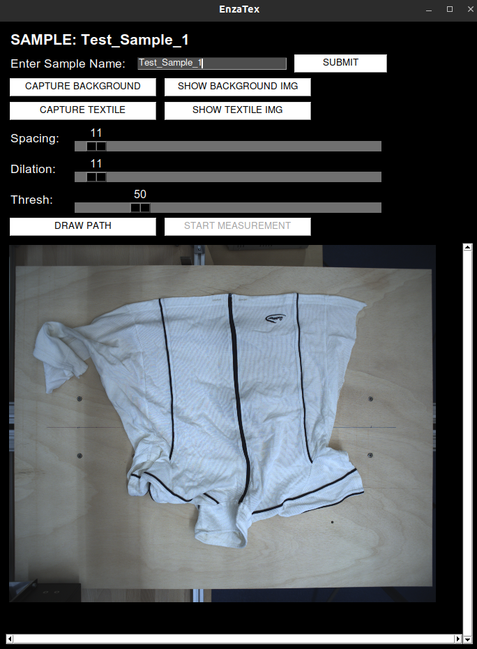

# EnzaTex PathGenerator

## Requirements
- [PySimpleGUI](https://github.com/PySimpleGUI/PySimpleGUI)
- [PyYAML](https://github.com/yaml/pyyaml)
- [OpenCV2](https://github.com/opencv/opencv)

For Camera 
- [Harvesters](https://github.com/genicam/harvesters)
- camera driver (e.g. commom vision blox)

To install requirements:

```
pip3 install -r requirements.txt
```

## Info
In [ui_path_generator.py](https://github.com/markusltnr/EnzaTex_PathGenerator/blob/main/ui_path_generator.py#L14), only a dummy function is called. The communication to start the real measurement can be implemented there. 
The coordinates are given as input to the function, they are arranged as a numpy array in the form of Nx2, where N is the number of waypoints. The points are already sorted such that the measurements are in meander form. 

For test purposes, a dummy_camera.py script uses OpenCV VideoCapture to capture pictures from the webcam. Comment out Line 7 in [ui_path_generator.py](https://github.com/markusltnr/EnzaTex_PathGenerator/blob/main/ui_path_generator.py#L7) and uncomment Line 8 to use the dummy camera.
 
## Usage
To start the GUI, just run 
``` 
python3 ui_path_generator.py
```
First, a sample name needs to be entered. After that, one can capture a background image (image without textile placed on the platform) and a textile image by clicking the buttons. With the sliders, the parameters for 
- spacing (distance between two rows in mm), 
- dilation (distance added at the edges of the textile mask) and a 
- threshold for the seperation of background and textile image 

can be set. The draw path button will then calculate the path, display a visualization of the meandering measurement path and save the coordinates, background and textile images with the sample input as name to the corresponding folders. The start measurement button calls the dummy function and resets the GUI. 
A log is saved to the log folder that includes the sample name, timestamp, and parameters in a csv file. 

The [path_generator.py](https://github.com/markusltnr/EnzaTex_PathGenerator/blob/main/path_generator.py) includes the path generation function that takes the camera parameters, a background image, a textile image as well as the threshold, spacing and dilation parameters and returns the coordinates and a visualization image. 
It can be tested on it's own by running
``` 
python3 path_generator.py
```

It will take [background/2000.bmp](https://github.com/markusltnr/EnzaTex_PathGenerator/blob/main/background/2000.bmp) as background image and [textiles/2001.bmp](https://github.com/markusltnr/EnzaTex_PathGenerator/blob/main/textiles/2001.bmp) as textile image and display the visualization with OpenCV imshow() and print the coordinates in the terminal. 


## Camera Calibration
A Camera calibration file is needed to run the scripts. If you want to create a new one, use the [camera_calibration.py](https://github.com/markusltnr/EnzaTex_PathGenerator/blob/main/camera_calibration.py#L26) file. This file takes images of the checkerboard ```EnzaTex/111*.bmp``` as specified in Line 26 and creates the camera calibration from them. The points of the inner checkerboard edges need to be provided in the [1111_checkboard_points.csv](https://github.com/markusltnr/EnzaTex_PathGenerator/blob/main/1111_checkboard_points.csv) file. The points are ordered from top left to bottom right like in this picture: [OpenCV Checkerboard](https://docs.opencv.org/3.4/fileListImage.jpg)

## GUI


## Contact
Markus Leitner - leitnermrks@gmail.com
